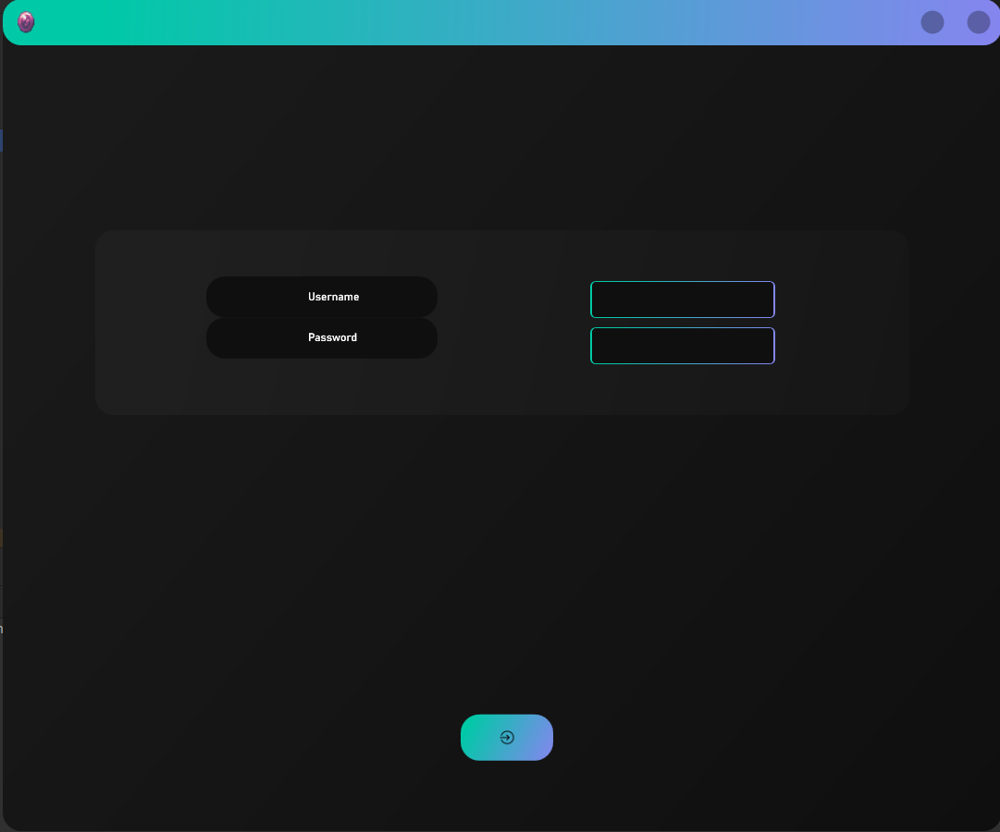
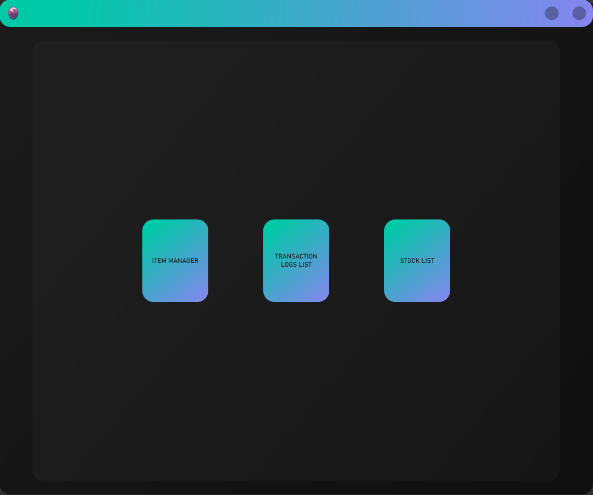
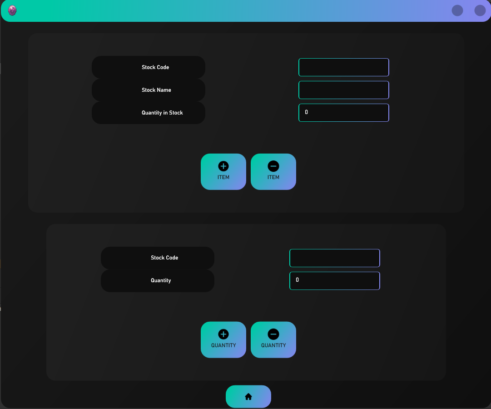
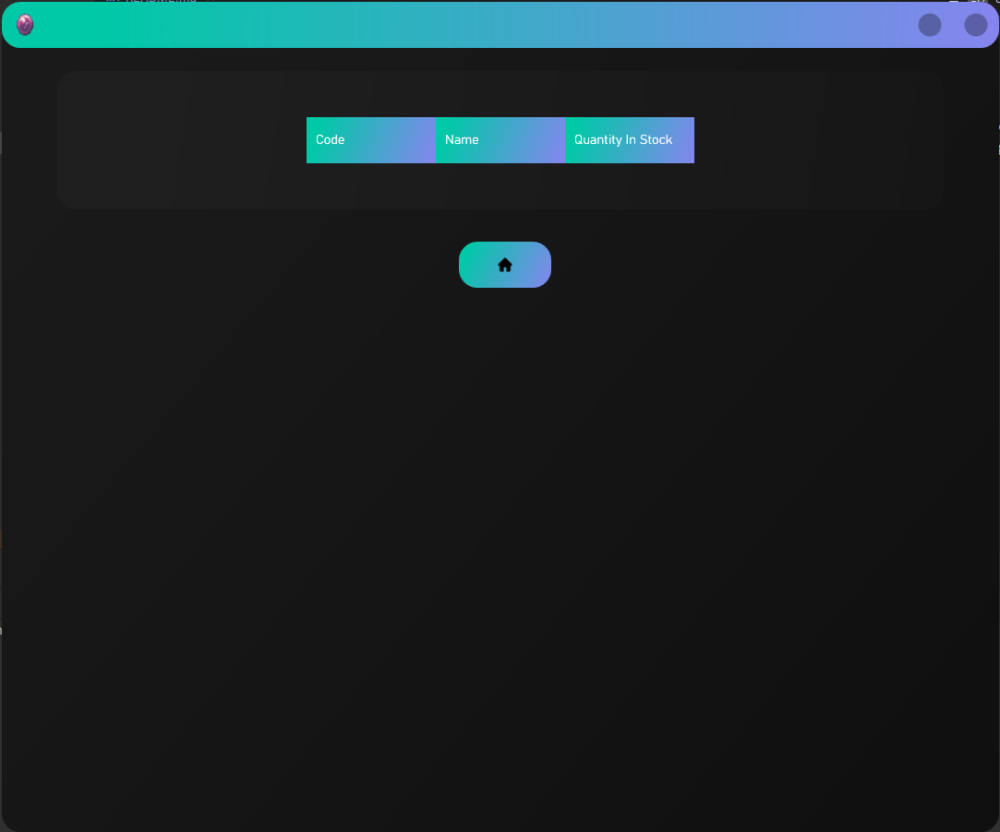
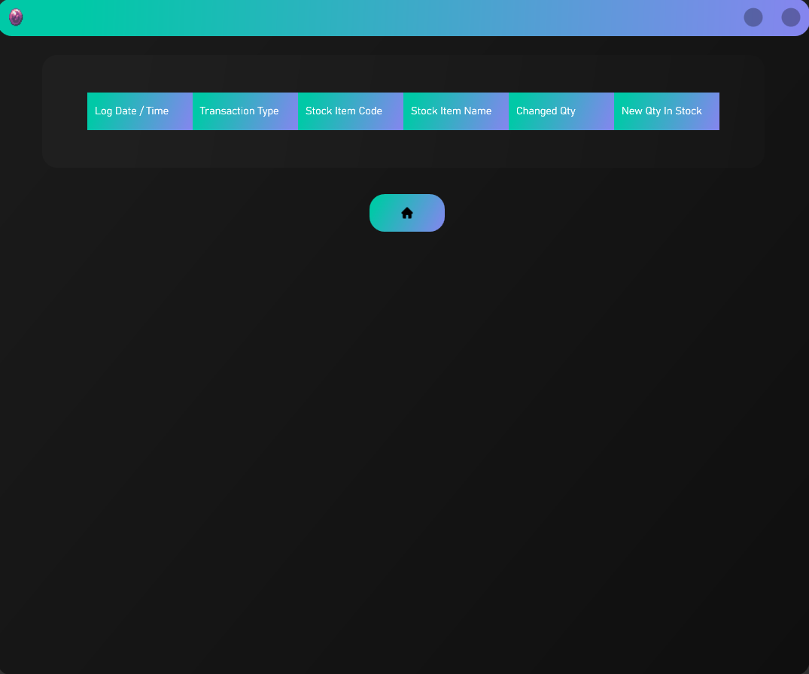

    

    
    
StockSurge is a user-friendly desktop application that empowers you to efficiently manage your stock items and view the transaction logs, all on a straightforward and intuitive interface.

    
    <ul>
        <li>Programming Language: C#</li>
        <li>UI Markup Language: XAML</li>
        <li>Database Handling Language: SQL</li>
        <li>Architectural Framework: Model-View-ViewModel (MVVM)</li>
        <li>Database: SQLite3</li>
    </ul>

    
    <ul>
        <li>Authorized Admin Login</li>
        <li>Create New Stock Items</li>
        <li>Remove Unused Stock Items</li>
        <li>Adjust a Stock Item's Quantity</li>
        <li>View Transaction Logs</li>
        <li>View Stock Levels</li>
    </ul>

    
    
    

        
    

    
    

        
    

    
    

        
    

    
    

        
    

    
    

        
    

    

    
    <ul>
        <li>.NET Framework 4.7.2 or a higher version installed on your system</li>
    </ul>
    
    <ol>
        <li>Clone the repository to your local computer.</li>
        <li>Navigate to the bin folder and double click on "StockSurge.exe".</li>
        <li>Login as an admin (username: admin, password: admin).</li>
        <li>Start managing your stock items!</li>
    </ol>

    
    
I am committed to making StockSurge better with your input. If you have suggestions, encounter any issues, or have ideas for improvement, please reach out to me. You can open an issue or even contribute via a pull request.

    

        <bold>Fun Fact:</bold>
        StockSurge was initially built as part of my COMP40003 Assessment!
    

